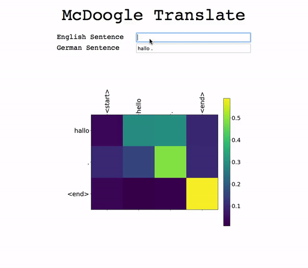
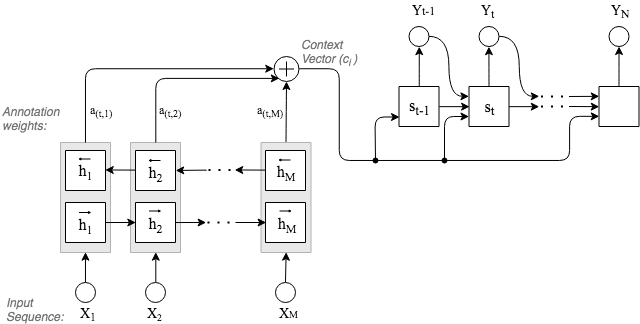

# Translating English to South African Sign Language

This project was started in 2019 for my Bachelor thesis. I attempted to use Neural Machine Translation to translate English into South African Sign Language. 

I started with the easier problem of translating English to German an example of which is shown below.



In case anyone ever reads this, I am in the process of cleaning up this repository. It was the first serious project I attemtped using Python as well as being the first time I trained a neural network. The messy original repo can be found [here](https://bitbucket.org/snake_in_the_grass/translationmodels/src/master/).

I believe that this could be an incredible useful tool. South African Sign Language is a heavily neglected language and many deaf, illiterate  South Africans would stand to benefit from it. I am maintaining the repository in the hope that that I can one day find the time to revisit this project and give it my full attention. 

## Model




## Training
```python
python translate.py --lang sasl --train --epochs=10 --batch=16 --lr=0.001 
```

## Evaluation
The model is evaluated using the BLEU score. 

## Checkpoints
Each one of the checkpoints is close to 500 MB. If you require a pre-trained model, feel free to reach out to me. 

## Run GUI
For a quick start (after training the model), run:

```python
python translate.py --lang sasl --gui 
```
